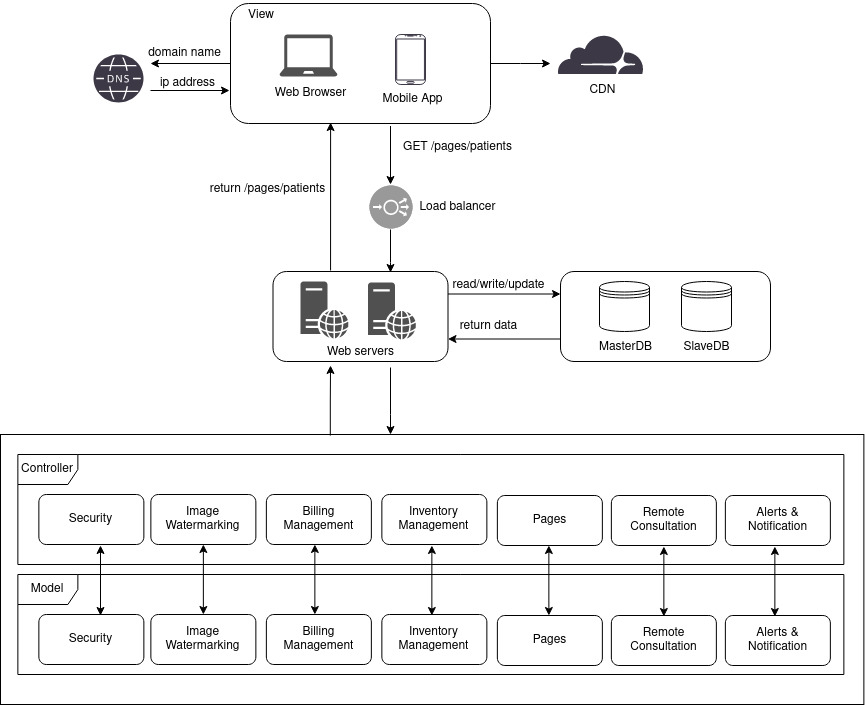

# Hayat Hospital Management System

### Background

Today’s medical diagnoses are a critical part of our patient experience, problems related to getting a
diagnosis from multiple hospitals are documented as diagnosis history, for example, currently if a patient
moves from one hospital to another, they need to describe the whole problem they are facing again to the
new doctor while showing the radiological image and orally speak out what previous doctors diagnoses
where. Furthermore, privacy breaches happen when an unauthorized entity accesses the printed or digital
patient diagnosis of radiological images resulting in a risk of patient data misuse or exploitation.

### Aim

Our project aims to revolutionize healthcare by creating a hospital management system that will implement
techniques to securely incorporate patient medical records with radiological images. This will allow for
integration between radiological images and patient records along with the ability to track medical
diagnoses easily, with the goal of creating a secure and comprehensive healthcare system that facilitates
better patient monitoring and diagnosis, ultimately creating a more efficient and secure hospital
management system.

### High level system architecture

## Building your environment

### Requirements

#### To install

- Node: v20.8.0

#### Dependencies (Included)

- React: 18.2.0
- Mantine (React UI framework): 7.1.7

### Running your development environment

`npm install` first time run to install node modules from package.json

`npm run dev` for running the application in development mode

`npm run build` build for production
